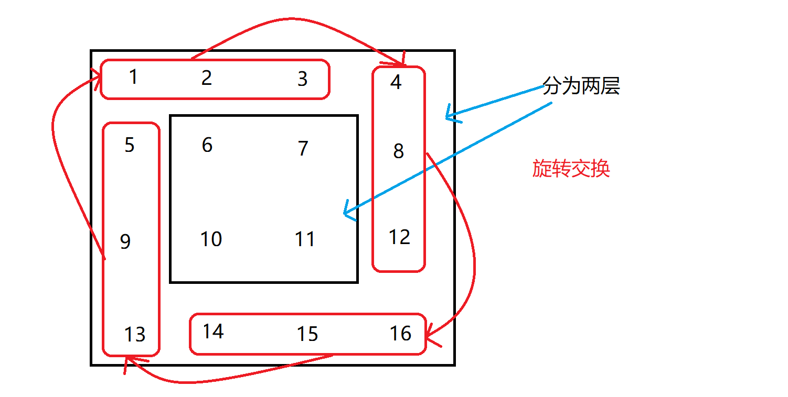

# 旋转矩阵

##  描述

给定一个 _n_ × _n_ 的二维矩阵表示一个图像。

将图像顺时针旋转 90 度。

**说明：**

你必须在**原地**旋转图像，这意味着你需要直接修改输入的二维矩阵。**请不要**使用另一个矩阵来旋转图像。

**示例 1:**

```text
给定 matrix = 
[
  [1,2,3],
  [4,5,6],
  [7,8,9]
],

原地旋转输入矩阵，使其变为:
[
  [7,4,1],
  [8,5,2],
  [9,6,3]
]
```

**示例 2:**

```text
给定 matrix =
[
  [ 5, 1, 9,11],
  [ 2, 4, 8,10],
  [13, 3, 6, 7],
  [15,14,12,16]
], 

原地旋转输入矩阵，使其变为:
[
  [15,13, 2, 5],
  [14, 3, 4, 1],
  [12, 6, 8, 9],
  [16, 7,10,11]
]
```

## 实现

### 1. 分层交换

思路：

* 矩阵是一层一层往里的，比如 3\*3 只有两层，里面一层是 1\*1 的矩阵，4\*4 有两层，里面一层是 2\*2 的矩阵
* 每一层的交换都是 n-1 个数旋转交换位置
* 开始时，记录交换的开始和结束索引，每次循环开始索引加一，结束索引减一，直到两者相等或开始大于结束时退出循环，这样就是循环每一层，两者相等时是因为只有一个数，不用交换
* 每一层中，利用一个中间数组、三个变动的索引和两个不变（开始与结束）的索引，进行旋转交换



```javascript
 /** 
 * @param
 *   matrix [object] matrix array
 * @return
 *   [void]
 */
var rotate = function(matrix) {
  //=> 记录开始和结束索引
  let start = 0,
      end = matrix.length-1;
  //=> 遍历每一层
  while (start < end) {
    // 中间数组
    let ary = [];
    // 三个变化的索引
    let i = start,
        j = end,
        k = 0; // 这是中间数组需要的索引，可以不用
    //=> 判断条件其实只需要其中一个达到条件即可，因为循环次数都是一样的
    while (i < end && j > start) {
      ary[k] = matrix[start][i];
      matrix[start][i] = matrix[j][start];
      matrix[j][start] = matrix[end][j];
      matrix[end][j] = matrix[i][end];
      matrix[i][end] = ary[k];
      i++;
      j--;
      k++;
    }
    start++;
    end--;
  }
};
```

